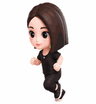
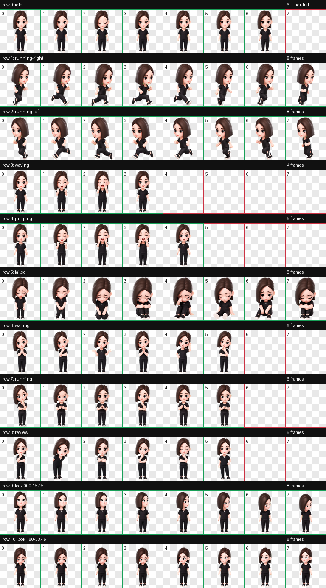
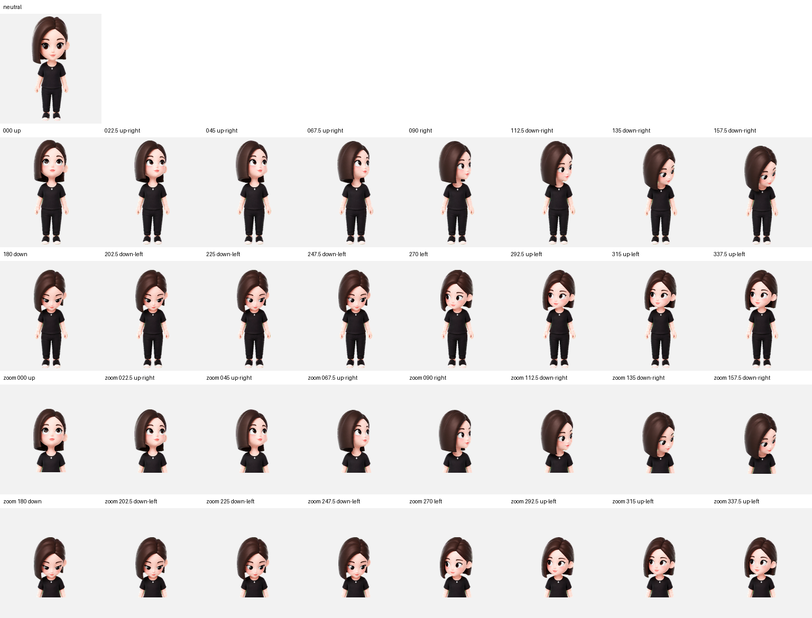

# 豆包 Codex 桌面宠物

一个基于豆包头像参考制作的 Codex 自定义桌面宠物。


最近修复：Codex 当前点击/轻触会触发标准动作第 4 行，所以这一行已经从跳跃改成 5 帧夸张大笑。现在点击豆包会大笑，不会再跳起来。

> 非官方作品，仅用于个人学习、展示和 Codex 宠物创作示例；不隶属于豆包、字节跳动或任何官方产品。

## 效果预览

| 未工作待机 | 向右跑 | 向左跑 |
| --- | --- | --- |
|  |  |  |

| 工作中 | 点击大笑 | Review |
| --- | --- | --- |
|  |  |  |

## 完整动作表



## 方向跟随

这个宠物使用 Codex v2 宠物格式，额外包含 16 个看向方向。鼠标或指针移动时，豆包会通过眼神、眉眼、头颈微转和上身轻微跟随来表达方向，而不是整个人机械旋转。



## 安装方式

把 `pet/` 目录里的两个文件复制到 Codex 的宠物目录：

```bash
mkdir -p ~/.codex/pets/doubao
cp pet/pet.json pet/spritesheet.webp ~/.codex/pets/doubao/
```

安装后，Codex 会读取：

```text
~/.codex/pets/doubao/pet.json
~/.codex/pets/doubao/spritesheet.webp
```

如果 Codex 已经打开，可能需要重启或重新加载宠物列表。

如果鼠标方向跟随没有立刻生效，请确认使用的是 `custom:doubao`，并重启 Codex 或切换到其他宠物后再切回豆包。这个包的 `pet.json` 已启用 `spriteVersionNumber: 2`，spritesheet 的第 9、10 行包含完整 16 个方向帧。

## 动画内容

- `idle`：未工作时的安静待机，包含轻微呼吸和眨眼。
- `running-right`：向右移动动画。
- `running-left`：向左移动动画。
- `waving`：备用互动/大笑动作，保留夸张笑脸反馈。
- `jumping`：Codex 点击/轻触触发行，已改为 5 帧夸张大笑。
- `failed`：失败或受阻时的小失落动作。
- `waiting`：等待用户输入或授权时的期待动作。
- `running`：工作中/处理中动画，表现为原地专注思考，不是移动跑步。
- `review`：完成后查看结果的动作。
- `look-row-9`、`look-row-10`：16 个方向的 v2 gaze cells。

## 技术规格

- Codex pet 格式：v2
- `spriteVersionNumber`: `2`
- spritesheet 尺寸：`1536 x 2288`
- 单元格尺寸：`192 x 208`
- atlas 网格：`8 列 x 11 行`
- 主文件：`pet/spritesheet.webp`
- 配置文件：`pet/pet.json`

本作品已经通过 v2 atlas 校验：尺寸、透明通道、空白单元格、chroma despill 和方向 QA 均已完成。

本仓库保留了本次瘦身调整脚本 `tools/slim_pet_atlas.py`，默认横向比例为 `0.86`。它按单元格处理透明 spritesheet，不会改变 atlas 尺寸或动画行列结构。

`tools/fix_codex_bindings.py` 用来修复 Codex 点击动作绑定：把大笑动作复制到运行时实际点击触发的第 4 行，同时保留 v2 方向跟随行。

## 项目结构

```text
.
├── README.md
├── LICENSE
├── assets
│   ├── contact-sheet-extended.png
│   ├── chroma-despill-extended.json
│   ├── look-directions.png
│   ├── validation-extended.json
│   └── previews
│       ├── click-laugh.gif
│       ├── failed.gif
│       ├── idle.gif
│       ├── jumping.gif
│       ├── review.gif
│       ├── running-left.gif
│       ├── running-right.gif
│       ├── waiting.gif
│       └── working.gif
├── pet
    ├── pet.json
    └── spritesheet.webp
└── tools
    ├── fix_codex_bindings.py
    └── slim_pet_atlas.py
```

## 许可

代码、README 和仓库结构使用 MIT License。图像资产是基于用户提供头像参考生成的衍生宠物素材；二次使用时请保留本 README 中的非官方说明，并尊重相关角色、品牌或头像权益。
